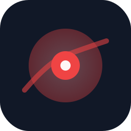

# Lazy Laser

A tiny **Windows** tray app that draws a fading red laser trail on top of any app — PowerPoint, Excel, Word, browser, and more. Same feel as the laser in [Prez](https://github.com/planomy/prez).



## How it works

- Transparent **always-on-top overlay** across all monitors
- **Clicks pass through** — keep using the app underneath
- Tracks the system cursor when laser mode is on
- Trail fades out over ~1 second

## Requirements

- **Windows 10/11**
- Node.js 20+ (for dev/build only)

## Run locally

```bash
npm install
npm start
```

## Build portable Windows `.exe`

On a Windows PC:

```bash
npm install
npm run pack:win
```

Output: `release/Lazy Laser *.exe` — no installer, runs from the folder.

## Controls

| Action | Shortcut |
|--------|----------|
| Toggle laser on/off | **Ctrl+Shift+L** |
| Clear trail | **Ctrl+Shift+Backspace** |
| Toggle laser | Click tray icon |
| Quit | Tray menu → Quit Lazy |

## Tips

- Allow the app to run in the background so the global hotkey works.
- Works over most desktop apps and slideshows; some secure fullscreen viewers may block overlays.
- **iPad:** system-wide overlay is not possible on iPadOS — this is PC only.

## Dev on Mac

You can `npm start` on macOS to smoke-test the tray app, but the overlay is built for **Windows**. Give your mate the `.exe` for the real test.
